## Part 6. **GoAccess**

### **GoAccess**

<a href="https://goaccess.io">GoAccess</a> is an open source real-time web log analyzer and interactive viewer that runs in a terminal in *nix systems or through your browser.

GoAccess is a log analyser that can handle logs in real time, visualise the information and pass it on via either a terminal or a web browser as a web page.

It provides fast and valuable HTTP statistics for system administrators that require a visual server report on the fly.

**== Task ==**

1. Use the GoAccess utility to get the same information as in [Part 5](#part-5-monitoring)
2. Open the web interface of the utility on the local machine.

On MacOS: `brew install goaccess`

On Ubuntu: `sudo apt-get install goaccess`

Use `goaccess --help` to see all the available commands.

You can find the link to instraction with basic commands <a href="https://goaccess.io/get-started">here</a>.

1. Terminal Output
>goaccess access.log -c 

1. Static HTML Output
>goaccess access.log -o report.html --log-format=COMBINED

1. Real-Time HTML Output
>goaccess access.log -o /var/www/html/report.html --log-format=COMBINED --real-time-html

We only need first and second version for this task.
First of all, we can use the terminal of our Ubuntu Virtual Machine to access the output: `goaccess ../04/*.log --log-format=COMBINED`.

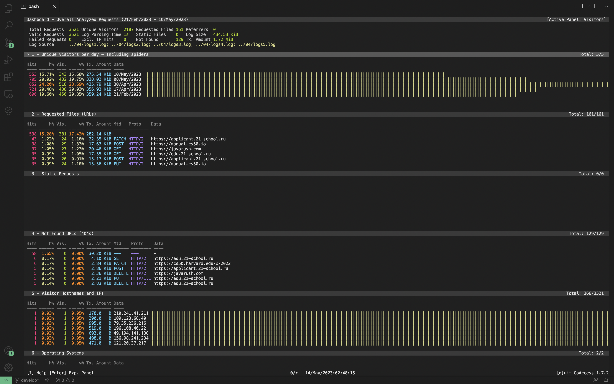
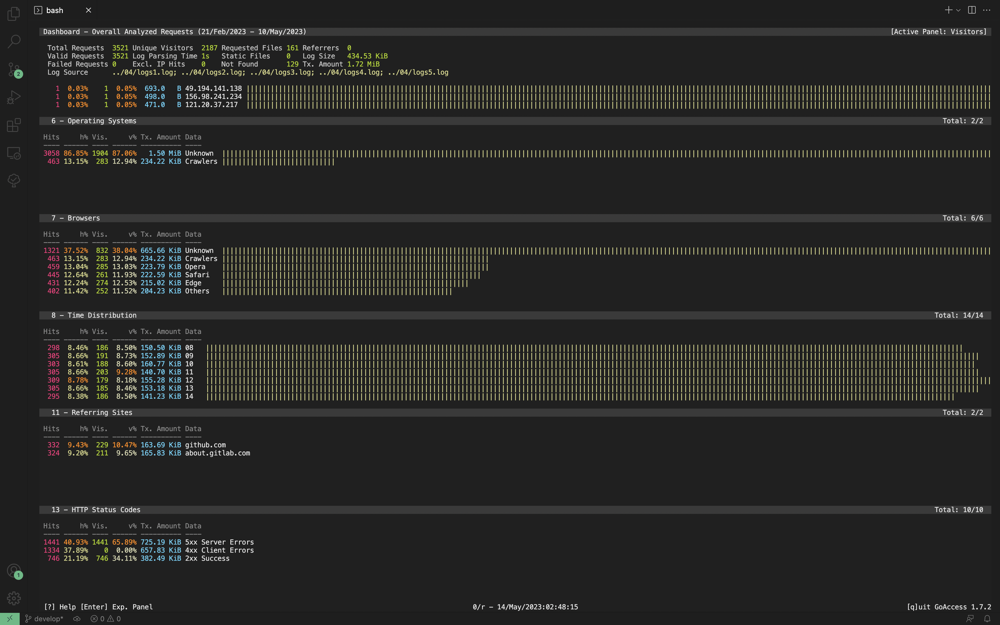

Second, we can use the same command on MacOS, but specifying <a href="https://github.com/allinurl/goaccess/issues/1563">the `LANG="en_US.UTF-8" bash -c` </a> before the command:
>LANG="en_US.UTF-8" bash -c 'goaccess ../04/*.log --log-format=COMBINED'

We can also save the output to the .html page with:
>LANG="en_US.UTF-8" bash -c 'goaccess ../04/*.log --log-format=COMBINED' > index.html

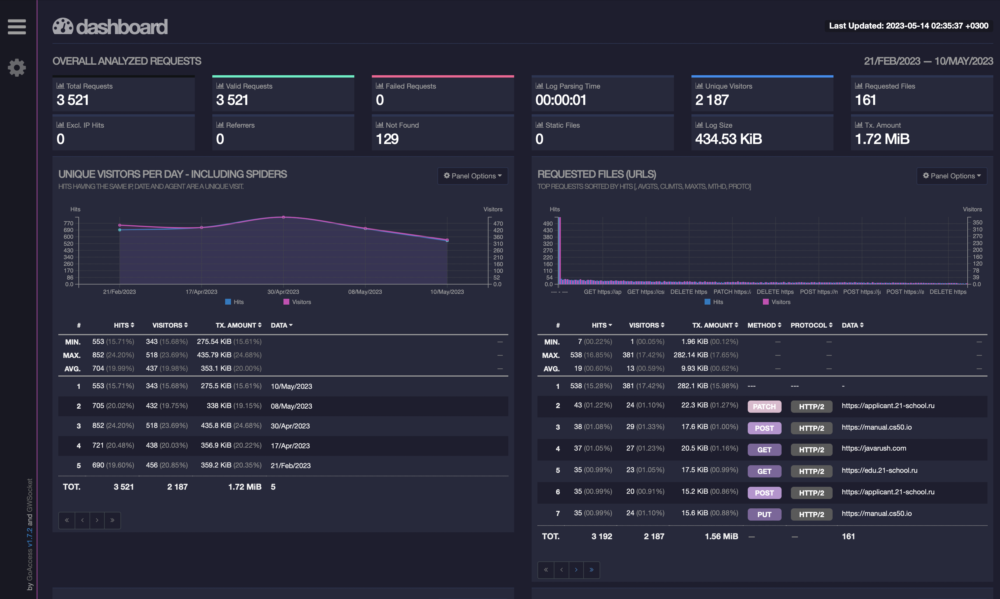

## Part 7. **Prometheus** and **Grafana**

### **Prometheus**

Time series databases, just as their name implies, are database systems, specifically developed to handle time-related data.

Most systems use relational, table-based databases. Time series databases work differently.
Data is still stored in 'collections', but these collections have one common thing: they aggregate over time.
Basically, this means that for each point that can be saved, there is a timestamp related to it.

Prometheus is a time series database to which an entire ecosystem of tools can be attached to extend its functionality.
Prometheus is created to monitor a wide variety of systems: servers, databases, virtual machines, basically almost anything.

### **Grafana**

Grafana is a platform for data visualisation, monitoring and analysis.
Grafana allows users to create *dashboards* with *panels*, each displaying specific indicators over a set period of time.

Each *dashboard* is universal, so it can be customised for a certain project.

*Panel* is the basic visualisation element of the selected indicators.

*Dashboard* is a set of one or more panels placed in a grid with a set of variables (e.g. server name, application name, etc.).

**== Task ==**

##### ! Install on VM/Server, check via web browser on local machine !

P.S. You only need Prometheus, Node Exporter and Grafana on your server, do not install on local machine! It works from the server.

1. Install and configure <a href="https://prometheus.io/download/">Prometheus</a>, Node Exporter (to transfer data from VM to Prometheus) and <a href="https://grafana.com/grafana/download?pg=get&plcmt=selfmanaged-box1-cta1">Grafana</a>  in virtual machine

P.S. if you are not the root user add `sudo` before the commands.

For Prometheus:
```
mkdir -p /etc/prometheus
mkdir -p /var/lib/prometheus
wget https://github.com/prometheus/prometheus/releases/download/v2.44.0/prometheus-2.44.0.linux-amd64.tar.gz
tar -xvf prometheus-2.44.0.linux-amd64.tar.gz
rm -rf prometheus-2.44.0.linux-amd64.tar.gz
cd prometheus-2.44.0.linux-amd64
mv prometheus promtool /usr/local/bin/
mv consoles/ console_libraries/ /etc/prometheus/
mv prometheus.yml /etc/prometheus/prometheus.yml
cd .. && rm -rf prometheus-2.44.0.linux-amd64
prometheus --version
prometheus --config.file=/etc/prometheus/prometheus.yml
```
Then go to `ip_address:9090` (by ip_address I mean real IP of your VM) from your local machine to check connection. You will get this page:

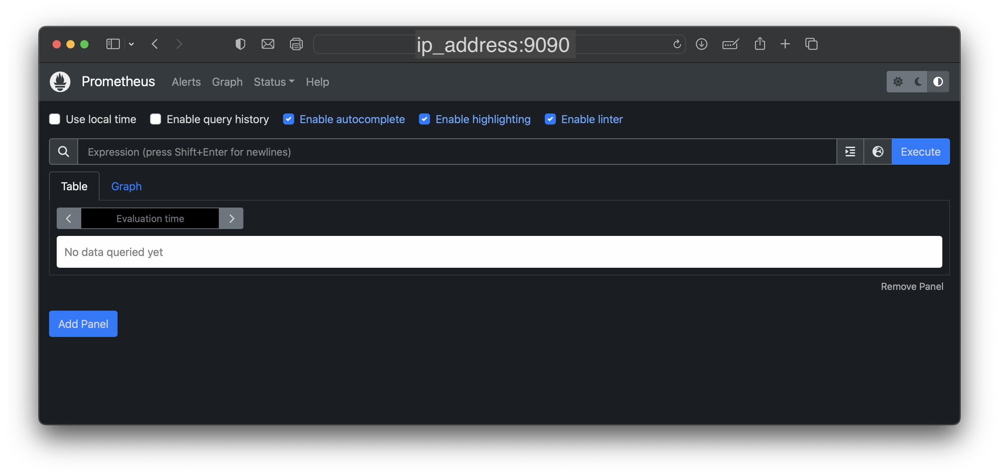

For Grafana (only with VPN):
```
apt-get install -y adduser libfontconfig1
wget https://dl.grafana.com/enterprise/release/grafana-enterprise_9.5.2_amd64.deb
dpkg -i grafana-enterprise_9.5.2_amd64.deb
rm grafana-enterprise_9.5.2_amd64.deb
systemctl daemon-reload
systemctl enable grafana-server
systemctl start grafana-server
```

If you don't have VPN on your rus_server then dowload on local machine the Ubuntu version and transfer to server via ssh.
```
curl -O https://dl.grafana.com/enterprise/release/grafana-enterprise_9.5.2_amd64.deb
scp grafana-enterprise_9.5.2_amd64.deb user@ip_address:/directory
```

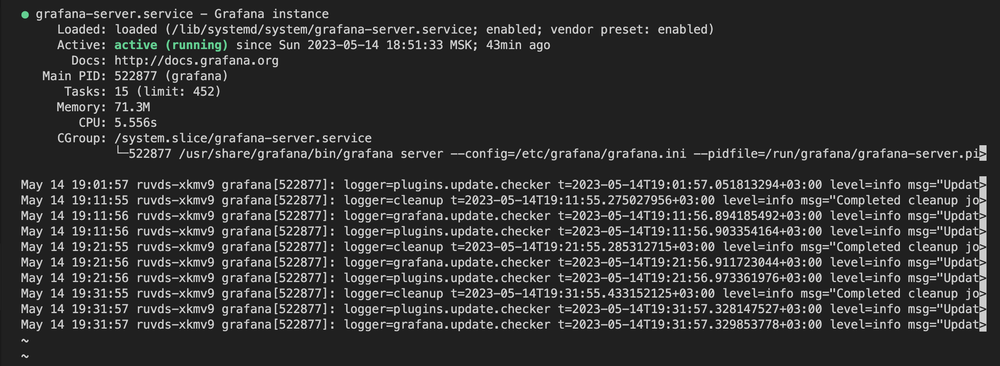

Then go to `ip_address:3000` from your local machine. You will get the welcome page, where the user name: `admin` and the password: `admin`. After that Grafana will ask you to set a new password.

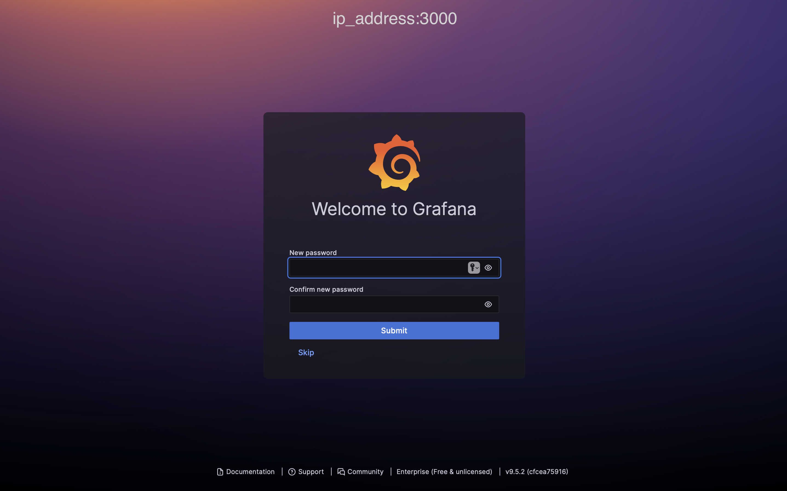

Then you will get access to the main page of Grafana Dashboards.

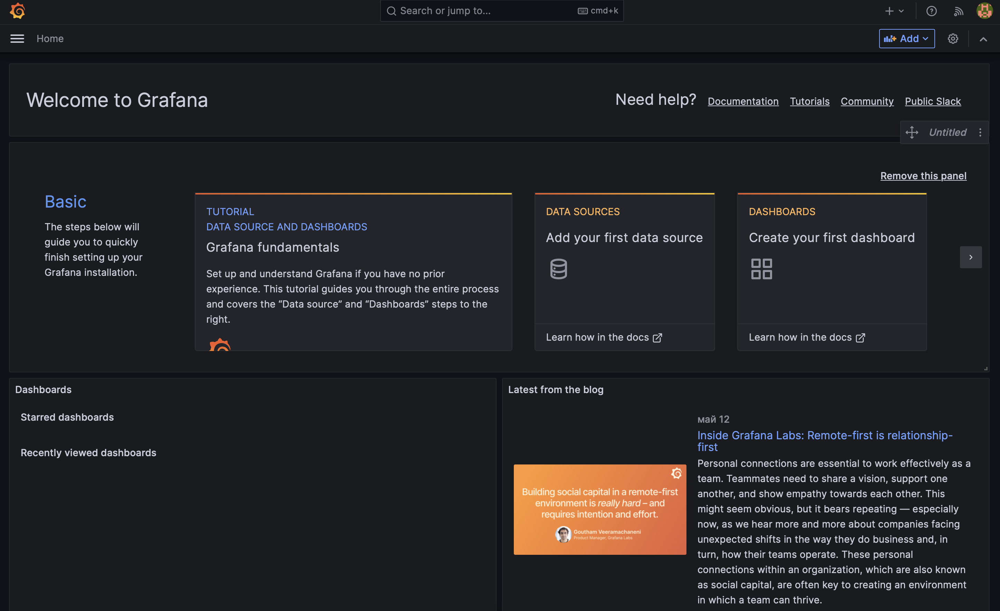

We also need NodeExporter for Prometeus to transfer the data from VM to Prometeus.

For Node Exporter:
```
wget https://github.com/prometheus/node_exporter/releases/download/v1.5.0/node_exporter-1.5.0.linux-amd64.tar.gz
tar -xvf node_exporter-1.5.0.linux-amd64.tar.gz
rm -rf node_exporter-1.5.0.linux-amd64.tar.gz
mv node_exporter /usr/local/bin/
node_exporter
```
Then go to `ip_address:9100` and `ip_address:9100/metrics` from your local machine.

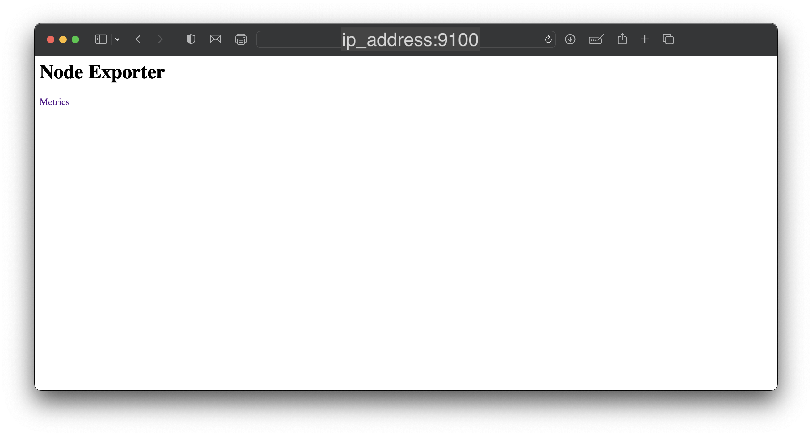
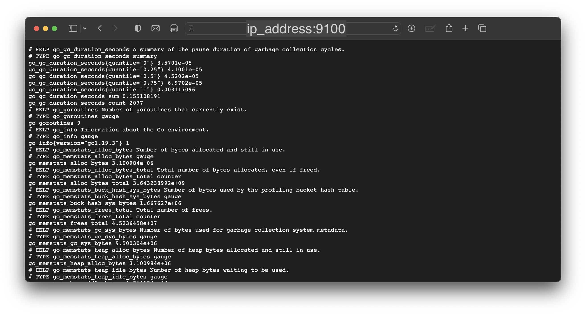

2. Access the **Prometheus** and **Grafana** web interfaces from a local machine

- `ip_address:9090` for prometeus
- `ip_address:3000` for grafana
- `ip_address:9100` for node-exporter

Change the file `vim /etc/prometheus/prometheus.yml`

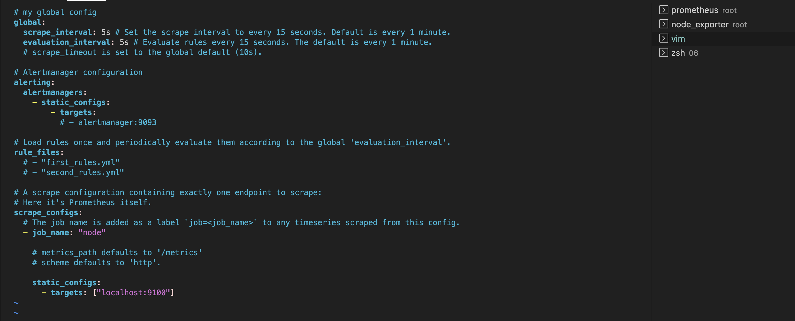

Restart Prometheus with a changed yml file:
>prometheus --config.file=/etc/prometheus/prometheus.yml

Check that Prometheus gets the metrics file from Node Exporter:
>http://ip_address:9090/metrics

3. Add to the **Grafana** dashboard a display of **CPU, available RAM, free space and the number of I/O operations on the hard disk**.

Go to web-resource of Grafana and `Add your first data source` -> **Prometeus**. As you can see on the pisture you need to write the `HTTP URL` and **Save**.

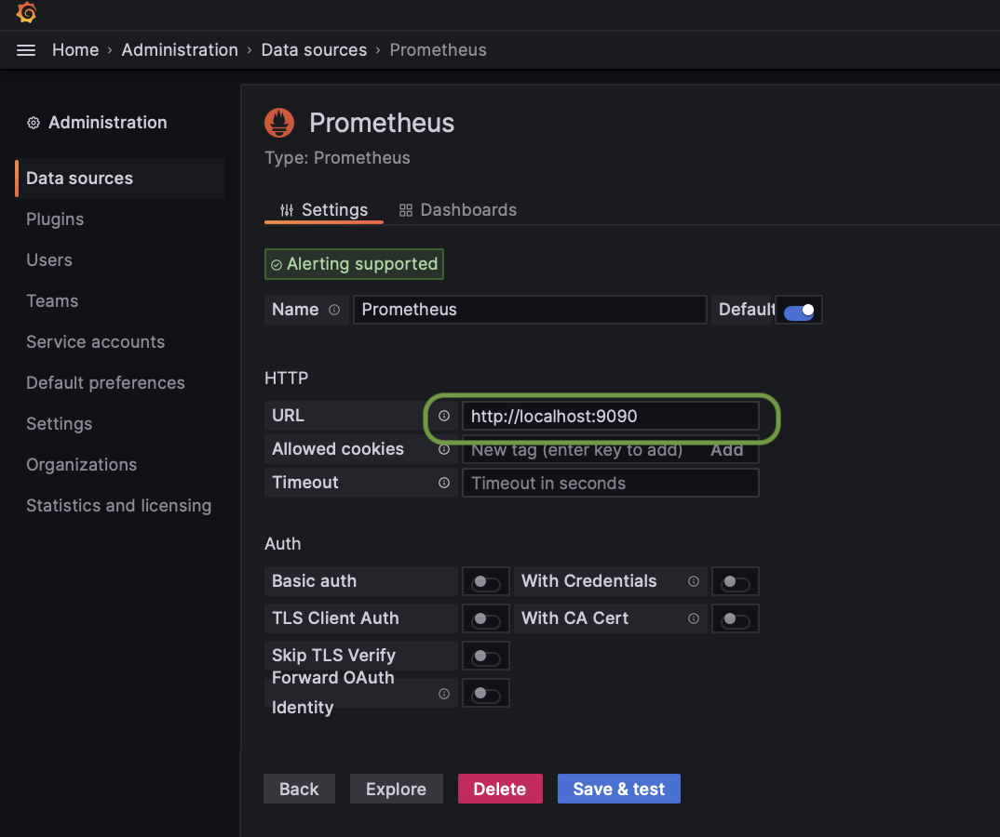

Now you can `Add your first Dashboard`.

This is which data I used for graphics (you can use something better than this):
For CPU: `100 - (avg by (instance) (rate(node_cpu_seconds_total{job="node",mode="idle"}[30s])) * 100)`
For RAM: `(node_memory_MemTotal_bytes - node_memory_MemFree_bytes)/1000000`
For free space: `node_filesystem_avail_bytes{device="/dev/sda1"} / 1024 / 1024 / 1024`
For the number of I/O operations on the hard disk: `node_disk_io_now`

4. Run your bash script from [Part 2](#part-2-file-system-clogging)

5. Check the hard disk load (disk space and read/write operations)

6. Install the **apt-get install stress** utility and run the following command `stress -c 2 -i 1 -m 1 --vm-bytes 32M -t 10s`

I used `stress -c 2 -i 1 -m 1 --vm-bytes 128M -t 10s` for visuality.

7. Check the hard disk, RAM and CPU load

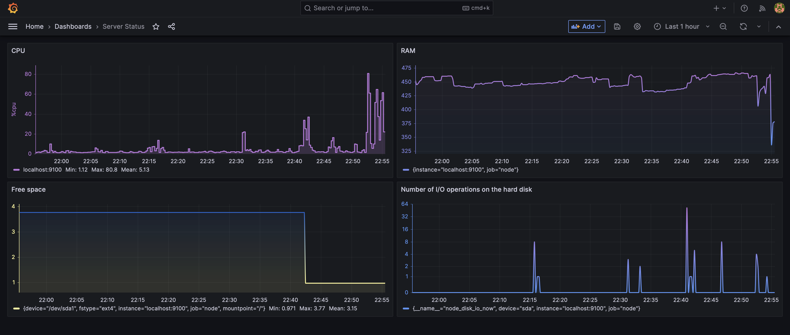
c

## Part 8. A ready-made dashboard

1. Download the ready-made dashboard <a href="https://grafana.com/grafana/dashboards/13978-node-exporter-quickstart-and-dashboard/">*Node Exporter Quickstart and Dashboard*</a> from **Grafana Labs** official website.

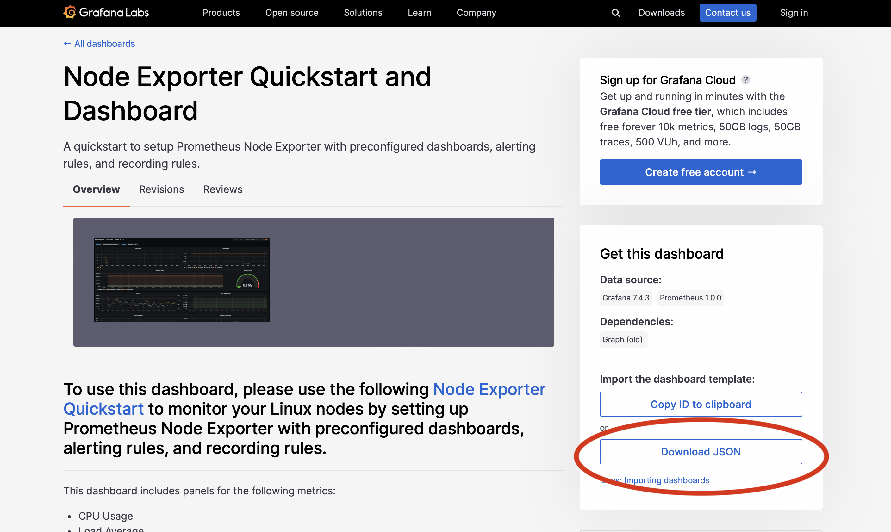

Go to Grafana web page -> Dashboard -> New -> IMPORT -> `node-exporter-quickstart-and-dashboard_rev2.json`

2. Run the same tests as in [Part 7](#part-7-prometheus-and-grafana)

3. Start another virtual machine within the same network as the current one. Run a network load test using **iperf3**

On VM/Server with flag `-s` means server:
```
apt-get install iperf3
iperf3 -s
```

On local machine with flag `-c` means client:
```
brew install iperf3
iperf3 -c <ip_address of VM>
```
4. Check the network interface load

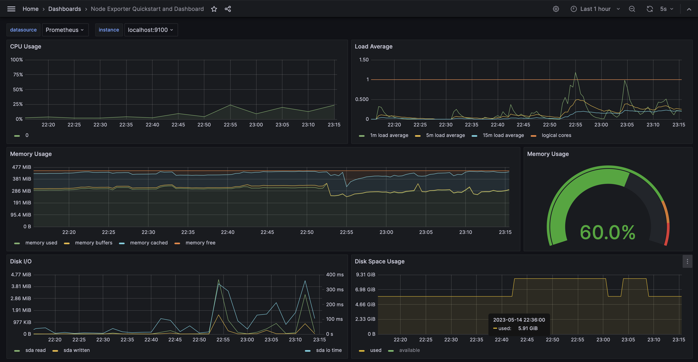
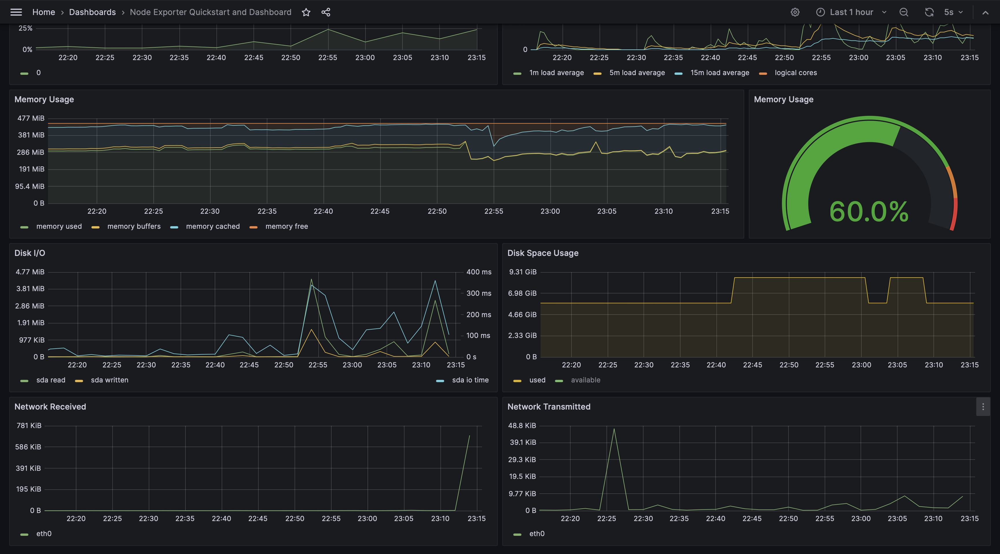

## Part 9. Bonus. Your own *node_exporter*

Write a bash script or a C program that collects information on basic system metrics (CPU, RAM, hard disk (capacity)). The script or a program should make a html page in **Prometheus** format, which will be served by **nginx**.

```
apt-get nginx
```

Go and change `vim /etc/nginx/nginx.conf`:
```
worker_processes  1;

events {
  worker_connections  1024;
}

http {
  server {
    listen 9999;
    root /var/www/new_dir;
    index metrics;

    location / {
      try_files $uri $uri/ =404;
    }
  }
}
```
Learn *nginx.conf* on <a href="https://www.nginx.com/resources/wiki/start/topics/examples/full/">official web-sit</a> and <a href="https://youtu.be/7VAI73roXaY">youtube</a>.

Create the needed directories and file. The file should be named `metrics`. You can name `new_dir` whatever you like, but it is better to save the default place: `/var/www/`.
```
mkdir /var/www/new_dir/
touch /var/www/new_dir/metrics
```
Restart *nginx* with `nginx -s reload` or `systemctl restart nginx`.

The page itself can be refreshed within a bash script or a program (in a loop), or using the cron utility, but not more often than every 3 seconds.

```
#!/bin/bash

if [[ $# -ne 0 ]] ; then
  echo -e "No arguments needed"
  exit 1
fi

while [[ 1 ]] ; do
  CPU=$(top -b -n 1 | grep "%Cpu(s):" | awk '{print $2}')
  RAM=$(grep MemAvailable /proc/meminfo | awk '{print $2}')
  HD=$(df / -m | grep / | awk '{print $4}')
  echo "my_node_cpu $CPU" > /var/www/new_dir/metrics
  echo "my_node_ram $RAM" >> /var/www/new_dir/metrics
  echo "my_node_hd $HD" >> /var/www/new_dir/metrics
  sleep 3
done
```

Access new data with `ip_address:9999` (you can choose any other number here instead `9999`, but make sure you set the same in nginx.conf). Check the `ip_address:9999/metrics` as prometeus reads the file named `metrics` by default. It shoud have the data that we sent:

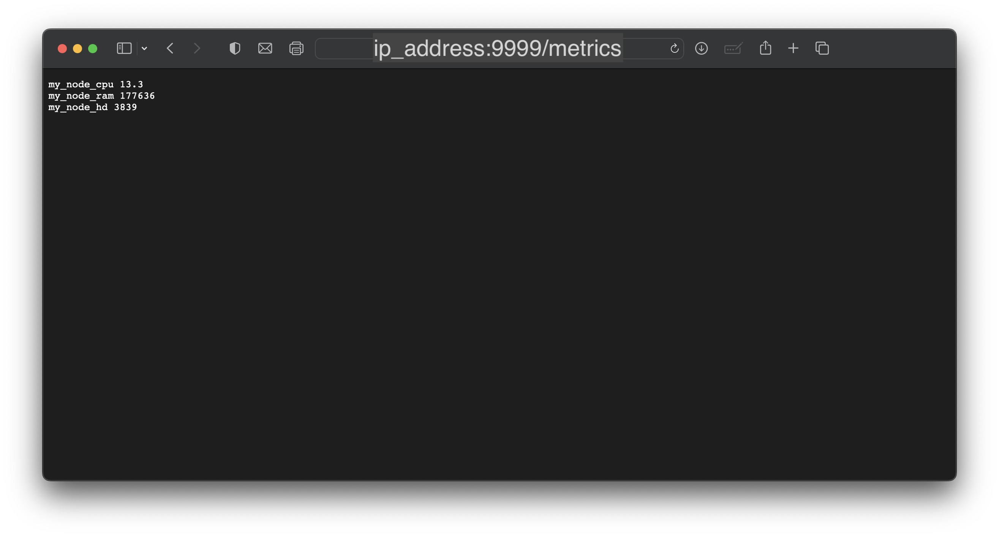

Change the **Prometheus** configuration file so it collects information from the page you created: `vim /etc/prometheus/prometheus.yml`

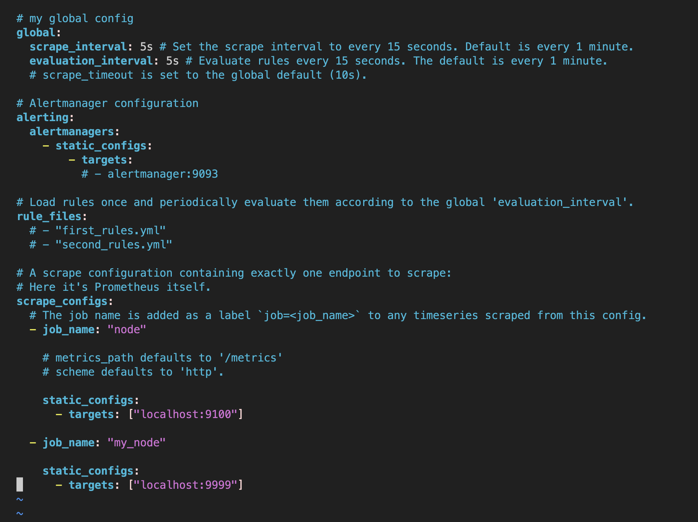

Run the same tests as in [Part 7](#part-7-prometheus-and-grafana)

- add new dashboard
- add three graphs: CPU, RAM, HD

For CPU: `my_node_cpu`
For RAM: `my_node_ram/1024`
For hard disk (capacity): `my_node_hd`

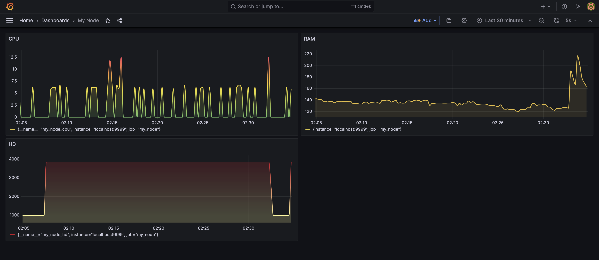

## More graphs and data

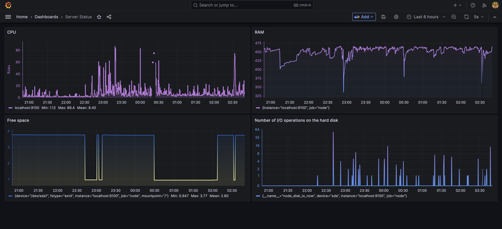
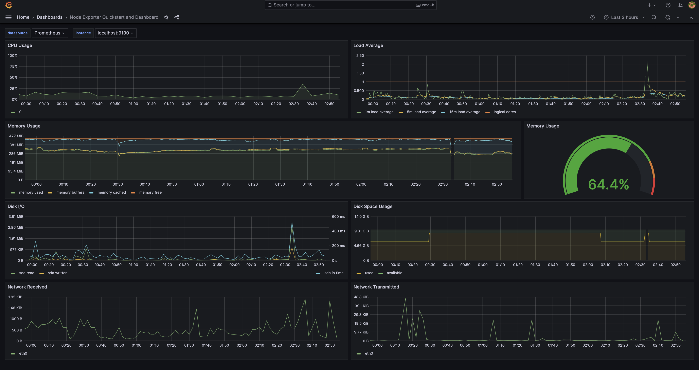
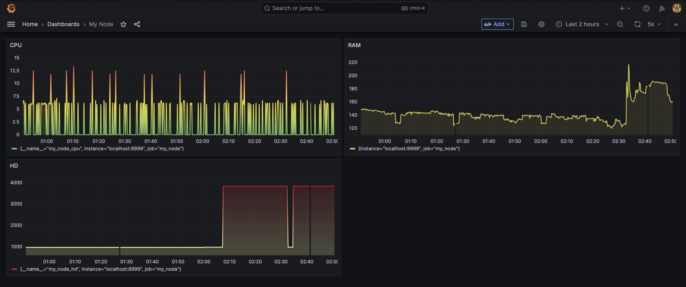
